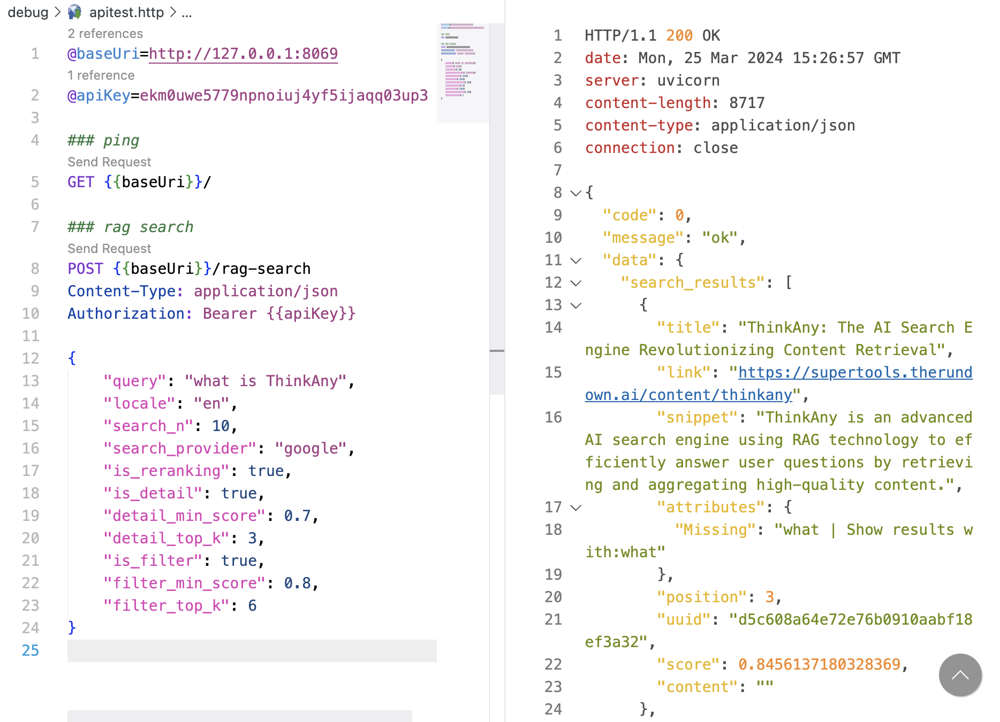

# rag-search

RAG Search API by [thinkany.ai](https://thinkany.ai)



## quick start

1. put .env file under root dir, set values like below:

```ini
SERPER_API_KEY=

OPENAI_BASE_URL=
OPENAI_API_KEY=
OPENAI_MODEL=gpt-3.5-turbo
OPENAI_EMBED_MODEL=text-embedding-ada-002

ZILLIZ_URI=
ZILLIZ_TOKEN=
ZILLIZ_DIM=1536
ZILLIZ_COLLECTION=

AUTH_API_KEY=
```

2. install dependencies

```shell
pip install -r requirements.txt
```

3. start FastAPI server

```shell
uvicorn main:app --reload --port 8069
```

4. make api request

```txt
@baseUri=http://127.0.0.1:8069
@apiKey=xxx

### ping
GET {{baseUri}}/

### rag search
POST {{baseUri}}/rag-search
Content-Type: application/json
Authorization: Bearer {{apiKey}}

{
    "query": "ThinkAny.AI",
    "search_n": 10,
    "search_provider": "google",
    "is_reranking": true,
    "is_detail": true,
    "detail_min_score": 0.7,
    "detail_top_k": 3,
    "is_filter": true,
    "filter_min_score": 0.8,
    "filter_top_k": 6
}
```